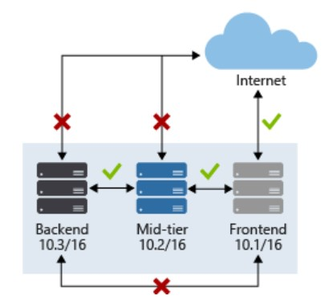
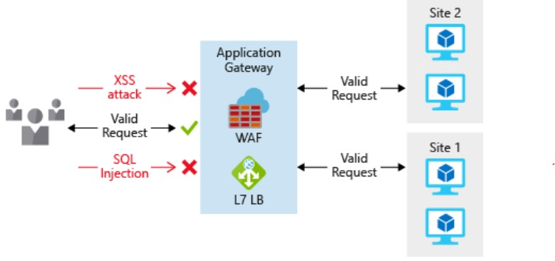
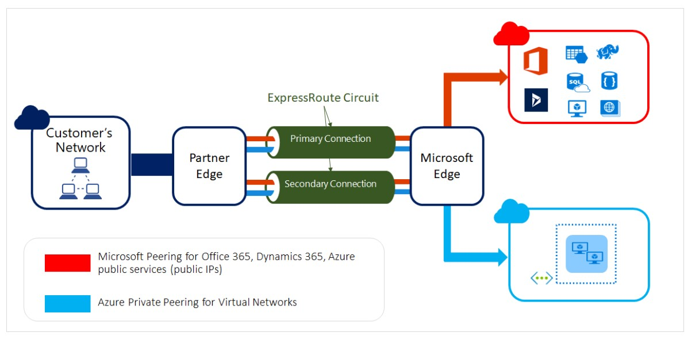

Security is a shared responsibility. It needs to be considered in each layer and at every component level. Even smaller negligence may cause damage to users, vendors, and clients.  If you are preparing for Azure Certification (AZ-300) or new to designign space, hope this post will help. In this post I will talk about the basic design principle and considrations around Network security.

<!--more-->

While designing the Network architetcutre, you must follow '**Closed by default and open by exception**' principle. 
This will help you design the secure traffic flow between the applications, internet, and users.

Consider a requirement where your application requires to communicate with other applications/resources along with third-party APIs. To secure traffic flow between the applications and the internet your design must include configurations that control the application exposure to the external network or the internet. 

You also need to pay close attention to controlling the communication between the application resources and data. 

By limiting exposure between these resources, you reduce the effect a compromised resource can have. This can help reduce further propagation within a network.

For example your application requires following Azure resoruces:
-   Azure Web App
-   Function Apps 
-   Commos DB
-   KeyVault
-   Storage etc.

All of them are the PaaS resource, but you can still secure the traffic flow between the resoruces, internet, and users. 

## **VNET Level Protection**:

Design a Virtual network, where you have NSG rules which only allow communication over port 80 and/ or 443 (prefred) along with HTTP and/ or HTTPS (prefred) over the internet. 

Apply NSG policies at Subnet level. This way you can better control the communication between your resources (e.g. Frontend subnet resoruces are not allowed to communicated to backend subnet resources directly and midtier subnets and backend subnet can not be access over internet). 

Also, create a VNET endpoint for the web app. Add your web app inside the VNET endpoint. 

Similarly, you can have a VNET endpoint for Cosmos DB, KeyVault, Storage. 

If you want to add Azure Function inside your VNET, you need to opt for a premium hosting plan.

> Virtual Network (VNet) service endpoints extend your virtual network private address space. The endpoints also extend the identity of your VNet to the Azure services over a direct connection. Endpoints allow you to secure your critical Azure service resources to only your virtual networks. Traffic from your VNet to the Azure service always remains on the Microsoft Azure backbone network.

VNET provides default  DDoS (distributed denial-of-service attack) for free, but if you are looking for enterprise-grade DDoS please opt for DDoS Protection standard. 

This provides enhanced DDoS mitigation capabilities for your application and resources deployed in your virtual networks.

> DDoS Protection Standard utilizes dedicated monitoring and machine learning to configure DDoS protection policies tuned to your virtual network traffic profiles. 

 
 Attack telemetry is available through Azure Monitor, enabling alerting when your application is under attack. 

## **Internet level protection**:

To enhance network layer security always integrated Layer 7 application protection which can be provided by Application Gateway Web Application Firewall (WAF) or Azure Front door services. Consider this as .

> **Application Gateway** is a Layer 7 load balancer that also includes a web application firewall (WAF) to provide advanced security for your HTTP-based services. The WAF is based on rules from the OWASP 3.0 or 2.2.9 core rule sets and provides protection from commonly-known vulnerabilities such as cross-site scripting and SQL injection.

> **Azure Front door Service** provides: 
>-   SSL offload and application acceleration at the edge close to end-users.
>- Web Application Firewall (WAF) and DDoS Protection.
>- The central control plane for traffic orchestration
>- Global HTTP load balancing with instant failover.
>- Actionable insights about your users and back end.

## **How to protect Network Integration**?

You can have the following use cases:

- **VNET Peering** - VNET to VNET integration
- **Virtual Private Network (VPN)** -VNET to On-Premise - Network Integration over internet
- **ExpressRoute Connectivity** - Dedicated VPN 

**VNET Peering** - VNet peering is a mechanism that connects two virtual networks (VNets) through the Azure backbone network. Once peered, the two virtual networks appear as one for all connectivity purposes. 

This integration gives you the ability to provide the same fundamental layer of security across any peered VNets. Communication is only allowed between directly connected VNets.

Azure supports the following types of peering:

1. **Virtual network peering**: Connect virtual networks within the same Azure region.

2. **Global virtual network peering**: Connecting virtual networks across Azure regions

### **Virtual Private Network (VPN)**

Virtual private network (VPN) connections are a common way of establishing secure communication channels between networks, and this is no different when working with virtual networking on Azure. Connection between Azure VNets and an on-premises VPN device is a great way to provide secure communication between your network and your virtual machines on Azure.

Communication between networks happen using IP Secured tunnel over internet. 

You can have 2 type of VPN

#### **Site to Site (S2S) VPN** 
A Site-to-Site VPN gateway connection is used to connect your on-premises network to an Azure virtual network over an IPsec/IKE (IKEv1 or IKEv2) VPN tunnel. This type of connection requires a VPN device located on-premises that has an externally facing public IP address assigned to it. 

#### **Point to Site (P2S) VPN** 

A Point-to-Site (P2S) VPN gateway connection lets you create a secure connection to your virtual network from an individual client computer. 

Point-to-Site connections do not require a VPN device or a public-facing IP address. P2S creates the VPN connection over either SSTP (Secure Socket Tunneling Protocol), or IKEv2.

   

### ExpressRoute - A private dedicated network connection

Consider a use case where the client needs a dedicated private network that must be reliable, faster with lower latency between On-Prem and Cloud. 

**ExpressRoute** is an Azure service to address such requirements.  It doesn't go over the public. It provides layer 3 connectivity between On-Prem and the MS Cloud through connectivity providers.

ExpressRoute is a premium service and available across the geographical regions.

ExpressRoute provides built-in redundancy in every peering location to ensure higher reliability. 

 
## **How to secure non-HTTP bases services**?

non-HTTP-based services or for increased customization, network virtual appliances (NVA) can be used to secure your network resources. NVAs are similar to firewall appliances you might find in on-premises networks, and are available from many of the most popular network security vendors. NVAs can provide greater customization of security for those applications that require it, but can come with increased complexity, so careful consideration of requirements is advised.

> ***disclaimer***: References and images are taken from various MS documentations.